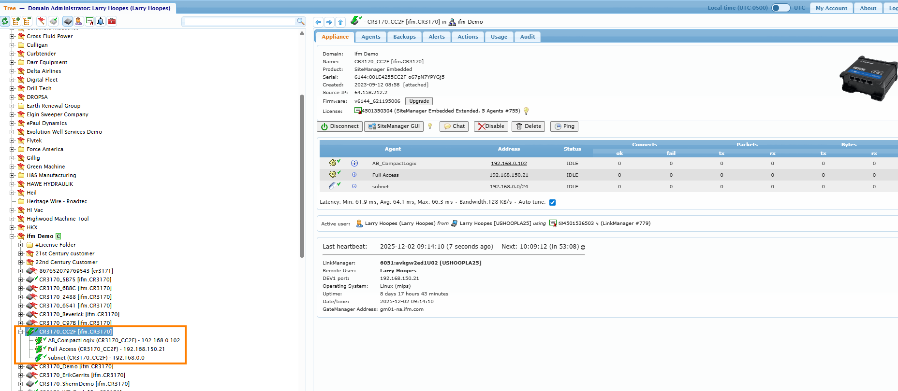

# Test Device Setup

This document describes how to connect to the controllers used for integration testing.

Two of them, and only one is ours. The **CompactLogix L32E** belongs to the ifm demo cell: reachable
through the Link Manager tunnel, and what every suite has run against so far, but nothing on it is ours
to change. We take its tags as we find them, and it is a 5X70, so it has no `LREAL` and no unsigned
integers. The **CompactLogix 5069-L306ER** is ours. It is on hand and not commissioned yet; the suite
that targets it is written, and every address in it is an assumption until the device is on the network
and provisioned to match.

Which way round that goes matters. On the L32E the device is the given and the tests are written to fit
it; on the L306ER the suite is the given and the controller gets provisioned to fit it. New integration
coverage belongs on the L306ER for that reason — a test that needs a tag can simply have one.

## How the integration tests are laid out

`tests/AllenBradley.Logix.Tests/Integration/` is split by what a suite is actually about:

| Folder                | What is under test                                                     | Device                          |
|-----------------------|------------------------------------------------------------------------|---------------------------------|
| `LibPlcTag/`          | libplctag on its own — no addon code in the picture                    | the L32E (borrowed)             |
| `CompactLogix5X70/`   | the addon's client stack, and the facts that are about this controller  | the L32E (borrowed)             |
| `CompactLogix5X80/`   | one write/read round trip per data type in the port's vocabulary        | the L306ER (ours, not up yet)   |

`PlcCollection` sits above all three: every test that touches a controller joins it, and it never runs
in parallel. They share one controller over one libplctag session, and concurrent operations on that
session collide.

## Prerequisites

- **ifm Link Manager** installed on your machine (see step 6 below)
- Certificate and password stored in KeePass under **`ifmCLT_CR3170_Cert.lmc`**

## 1. Connect via GateManager

1. Open [https://gm01-na.ifm.com/](https://gm01-na.ifm.com/)
2. Click **Link Manager** and select **Certificate** as the login method
3. Click **Choose File** and upload `ifmCLT_CR3170_Cert.lmc` (see KeePass)
4. Enter the password from KeePass
5. Navigate to **US → ifm Demo → CR3170_CC2F**
6. Click **CR3170_CC2F** and then **ConnectAll**
   - If Link Manager is not installed, use the **Install LinkManager** button on this page
7. Verify that all subnets under **CR3170_CC2F** show a **green lightning bolt** icon
   - This confirms the `192.168.0.x` subnet is routed through the Link Manager tunnel



## 2. The L32E — the borrowed controller

It is part of the ifm demo cell, shared with whoever else is using it, and we have no way to add a tag
or change a program on it. Everything in this section is a description of a device, not a
specification: if a tag below disappears, the suites that use it are what changes.

| Property | Value |
|----------|-------|
| Model | Allen-Bradley CompactLogix L32E |
| IP Address | `192.168.0.100` |
| Protocol | EtherNet/IP (`ab_eip`) |
| Backplane path | `1,0` |

> **Note:** `192.168.0.102` (labeled `AB_CompactLogix`) is a separate device and is not configured at this time.

Once the Link Manager tunnel is active, the PLC should be reachable from your machine:

```sh
ping 192.168.0.100
```

## 3. Available Tags

### Program tags — `Program:MainProgram`

These are the user-defined tags accessible for testing. The full tag name is `Program:MainProgram.<name>`.

| Tag | Notes |
|-----|-------|
| `strValue1` | String — **written by the test suite** (see below) |
| `strValue2` | String |
| `strVarString` | String |
| `IOLM` | IO-Link master data |
| `IOLM_PDI` | IO-Link Process Data In |
| `IOLM_PDO` | IO-Link Process Data Out |
| `Blink` | Boolean output |
| `Outon` | Boolean output |
| `Counter` | Counter — `Counter.PRE` is the only plain DINT the device exposes |

> **`strValue1` is written, not just read.** `LogixClientStringRoundtripTests` writes it once per
> theory case and reads it back. That is what the tag is for, so there is no save-and-restore; do not
> point any suite at a tag whose value someone depends on.

### Wire-format facts for `Program:MainProgram.strValue1`

The `STRING` converter's byte offsets hang off these. Two of the three were settled from libplctag's
documented Logix string layout rather than from the device, because the tunnel was down when the
converter was written; `StringWireFormatProbeTests` prints all three so they can be confirmed against
the real controller and this table completed. **Delete that probe once they are.**

| Fact | Value | Confirmed against the device? |
|------|-------|-------------------------------|
| Where `Tag.GetBuffer()` starts | At `.LEN`. libplctag strips the `A0 02 HH HH` abbreviated-structure prefix into its own type-info store and re-attaches it on write. Its Logix string defaults say the same: count word 4 bytes at offset 0, capacity 82, 2 pad bytes, 88 total | No — from libplctag |
| `ElementLength` in the `@tags` listing | Assumed **86** — the `.LEN` + `.DATA[82]` members without the alignment pad. May be 88 (padded) | **No — open** |
| The tag's string type | Assumed the built-in `STRING`, `.DATA[82]` | No — from libplctag's default |

The 86 assumption is load-bearing now, where it used to be tolerated. `TagsDecoder` subtracts the
4-byte `.LEN` from the listing's element length to get a `StringMaxLength`, so 86 decodes as the
82-character capacity `strValue1` is configured with and verification passes. If the controller
reports 88 instead, the same tag decodes as a capacity of 84, `LogixTypeComparison` reports
`StringCapacity`, and the connect aborts before a single `STRING` is polled — a padded size cannot be
read back as a capacity, because 88 is equally consistent with `.DATA[82]` and `.DATA[84]`.

Fixing that means reading the template (`@udt/<id>`) for the honest `.DATA : SINT[n]`, which is the
step [verifying configuration against the symbol
table](../../AllenBradley.Logix.Documentation/ADR/2026-07-21-verifying-configuration-against-the-symbol-table.md)
already defers to structured data-point support. Run `StringWireFormatProbeTests` before that becomes
necessary.

### Controller tags — IO-Link master (`AL1x2x_IOLink`)

| Tag | Length | Notes |
|-----|--------|-------|
| `AL1x2x_IOLink:I` | 452 bytes | Input data from IO-Link master |
| `AL1x2x_IOLink:O` | 304 bytes | Output data to IO-Link master |
| `AL1x2x_IOLink:C` | 108 bytes | IO-Link master configuration |

## 4. The CompactLogix 5069-L306ER — ours, not commissioned yet

The controller we own: a 5069-L306ER, 600 KB of user memory, a CompactLogix 5380 and therefore a 5X80
in this repo's vocabulary. It is here but not yet on a network, so nothing below has been confirmed
against it.

`Integration/CompactLogix5X80/` is the data-type suite that targets it: one write/read round trip per
type the port implements — `BOOL`, `SINT`, `INT`, `DINT`, `LINT`, `USINT`, `UINT`, `UDINT`, `ULINT`,
`REAL`, `LREAL`, `STRING` — each driven to both ends of its range, each also asserting the declaration
the controller reports for its tag.

It has to be a 5X80 because of `LREAL` and the unsigned integers. Those are the types in the vocabulary
a 5X70 has not got, so the L32E could not host this suite even if it were ours; see
[datatype-support.md](../../AllenBradley.Logix.Documentation/reference/datatype-support.md).

Because the device is ours, the tag list below is a **provisioning specification, not a survey**. When
the controller is commissioned, create these tags with these names and these types. If a suite needs a
tag it has not got, add the tag rather than bending the test around the controller — that freedom is
the whole reason new integration coverage goes here.

Two files hold everything the suite assumes, split along the line between what varies by machine and
what is a fact about the controller.

### `TagAddresses.cs` — the tags, as constants

One tag per type, all program-scoped in `MainProgram`:

| Type | Tag |
|------|-----|
| `BOOL` | `Program:MainProgram.testBool` |
| `SINT` | `Program:MainProgram.testSint` |
| `INT` | `Program:MainProgram.testInt` |
| `DINT` | `Program:MainProgram.testDint` |
| `LINT` | `Program:MainProgram.testLint` |
| `USINT` | `Program:MainProgram.testUsint` |
| `UINT` | `Program:MainProgram.testUint` |
| `UDINT` | `Program:MainProgram.testUdint` |
| `ULINT` | `Program:MainProgram.testUlint` |
| `REAL` | `Program:MainProgram.testReal` |
| `LREAL` | `Program:MainProgram.testLreal` |
| `STRING` | `Program:MainProgram.testString`, declared to hold 82 characters |

Constants, not environment variables. Which tags a controller holds is the same everywhere the suite
runs, so it belongs in the source and in review; on a controller we provision ourselves, this file is
the list to type into Studio 5000 rather than a guess to be corrected afterwards.

They are program-scoped deliberately: a program tag is browsed under a program-qualified key, and the
address the configuration tree composes has to agree with it — which a bare controller tag would not
prove.

> **Every one of these tags is written, not just read.** Provision them as tags nothing in the
> controller's program depends on. On a controller of our own that costs nothing — there is no program
> for them to disturb.

### `TestController.cs` — how the controller is reached

This is the part that varies by machine, so it is configurable. A direct connection is assumed: the
endpoint is the controller itself, on the EtherNet/IP port, over the virtual backplane.

| Variable | Default | Description |
|----------|---------|-------------|
| `CIP_5X80_GATEWAY` | `192.168.0.102` | Controller IP address — a placeholder until commissioning, see below |
| `CIP_5X80_PORT` | `44818` | TCP port the EtherNet/IP session is opened on |
| `CIP_5X80_PATH` | `1,0` | CIP route path to the CPU |
| `CIP_5X80_TIMEOUT_SECONDS` | `10` | How long one tag read or write may take |

The prefix is `CIP_5X80_` rather than the plain `CIP_` below, because those point at the L32E. Pointing
this suite at that controller would fail on the `LREAL` and the unsigned integers, for reasons that
read as a decode bug.

**Where the L306ER will sit is not decided yet** — a lab subnet behind the tunnel, or straight on the
office network. `192.168.0.102` is a placeholder standing in until it is: the second CompactLogix on
the lab subnet, labelled `AB_CompactLogix` and unconfigured, chosen because it is at least a real
address on a network the tunnel already routes. Replace it, or set `CIP_5X80_GATEWAY`, once the device
has an address. If it ends up behind a tunnel or a bridge, `TestController.cs` is the only file that
changes.

**Run `GeneralIntegrationTests` first against a newly provisioned controller.** Its
`Verify_EveryTypeInTheVocabulary_ReportsNoMisconfiguration` resolves every configured tag against
the symbol table in one go and reports each disagreement by name — missing, wrong type, wrong shape,
wrong capacity. That turns a set of wrong assumptions into a readable list, where the round trips would
give a failure per type that all say a read came back `Bad`.

`Verify_TagsConfiguredAsTheWrongType_AreEachReported` covers the other half: a tag that exists but is
declared as something other than what was configured. No round trip catches that for any type, since
the read decodes the bytes as whatever was configured. The unsigned integers are there as the case with
the least to go on — each is the same width as its signed twin, so neither direction gets even the
buffer-length backstop a width mismatch would.

## 5. Running the Integration Tests

The suites connect using environment variables with the defaults below. Override them if your setup
differs.

| Variable | Default | Description |
|----------|---------|-------------|
| `CIP_GATEWAY` | `192.168.0.100` | L32E IP address |
| `CIP_PATH` | `1,0` | Backplane routing path |
| `CIP_TAG_NAME` | `Program:MainProgram.strValue1` | Tag used by the raw-libplctag spike round trip |
| `CIP_DINT_TAG` | `Program:MainProgram.Counter.PRE` | Tag the shared-access concurrency probe hammers |
| `CIP_DUMP_PATH` | `tag-namespace-dump.txt` | Where the tag-namespace dump is written |

Only connection settings are environment variables, for either controller. Which tags a suite targets is
a fact about the device it runs against, so those names are constants — in
`Integration/CompactLogix5X70/LogixTagAddresses.cs` for the L32E, and in
`Integration/CompactLogix5X80/TagAddresses.cs` for the 5X80.

Run only the integration tests (needs the device reachable):

```sh
dotnet test -p:test-suite=integration
```

Run only the hardware-free tests (this is the default, and what CI runs):

```sh
dotnet test
```

> The classic VSTest `--filter "Category=..."` syntax does **not** work in this repo. Tests run on
> Microsoft Testing Platform with xUnit v3, and suites are selected through the `test-suite` MSBuild
> property. See [AGENTS.md](../../../AGENTS.md).
