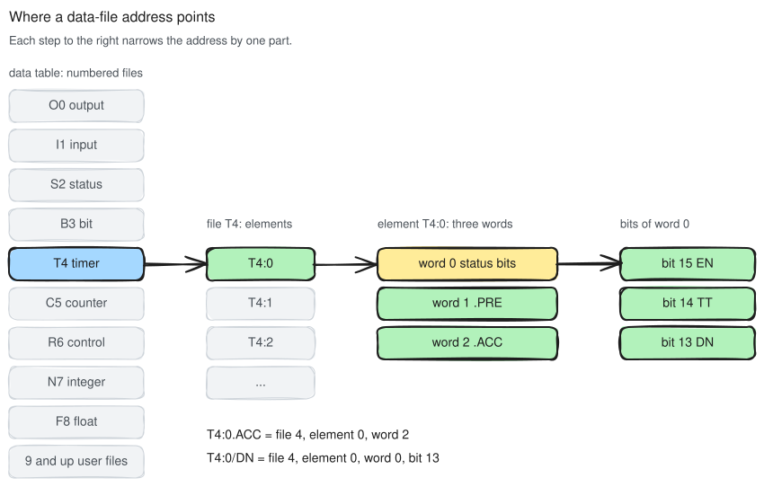
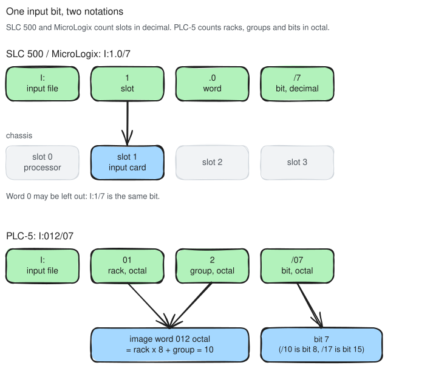
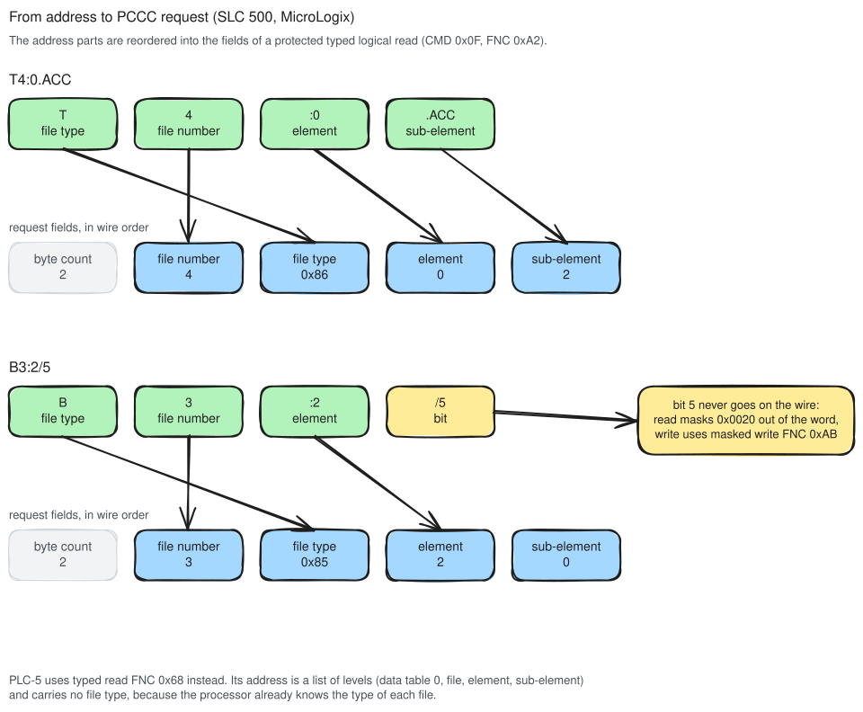

# How legacy addressing works

A PLC-5, SLC 500 or MicroLogix has no tag names on the wire. A client names a value by where it sits
in the controller's data table, so `N7:0`, `T4:0.ACC` and `I:1.0/7` are locations, not names. This page
explains what each part of such an address means, where the families disagree, and how an address
becomes the fields of a PCCC request. The file types and their element layouts are in
[PCCC data-file types](../../AllenBradley.Documentation/protocol/allen-bradley-extension/pccc-data-file-types.md),
and this page does not repeat them.

## The data table



The controller's memory is a data table made of numbered files. Each file has a type letter, and the
letter fixes the type of every element in it. An element is one or more 16-bit words, and a word has
16 bits. An address walks down those levels from left to right, and each part narrows it by one level:

```text
T4:0.ACC
│││  └── sub-element: the word inside the element (.ACC is word 2 of a timer)
││└───── element: 0
│└────── file number: 4
└─────── file type: T, timer
```

Every address has a file and an element. The sub-element is needed only where an element has more than
one word, which means timers, counters and control elements. Its mnemonic depends on the type: `.PRE`
and `.ACC` on a timer or counter, `.LEN` and `.POS` on a control element. A bare `T4:0` names the whole
three-word element.

The file letter and the file number travel together, and the number is the one the controller goes by.
`N7` and `N10` are both integer files, while `F7` cannot exist next to `N7`. Files 0, 1 and 2 are always
output, input and status, so their addresses leave the number out: `O:`, `I:` and `S:` mean `O0:`,
`I1:` and `S2:`. Files 3 to 8 have conventional default types, and every file from 9 up is whatever the
program created. An SLC file has at most 256 elements and a PLC-5 file up to 1000.

## Bits

A `/` picks a single bit out of a word. `B3:2/5` is bit 5 of element 2 in binary file 3, and the same
syntax works on any word, so `N7:0/15` is the sign bit of an integer.

Binary files also have a flat form that numbers bits across the whole file. `B3/37` is bit 37 counted
from the start of `B3`, which is element 2, bit 5, the same bit as `B3:2/5`. Both forms name one
location, and a client must treat them as equal.

The status bits of timers, counters and control elements have names. RSLogix 500 writes them as
`T4:0/DN`, RSLogix 5 as `T4:0.DN`. Either way the bit is bit 13 of word 0, the status word of the
element.

## I/O addresses differ by family

The data files from 3 up look the same on every family. The I/O image does not. Its notation follows
the hardware, and the hardware is organised differently.



An SLC 500 counts I/O by chassis slot. `I:1.0/7` is input file, slot 1, word 0, bit 7. Word 0 is the
default, so `I:1/7` names the same bit. Slot 0 of a modular SLC is the processor. On a MicroLogix,
slot 0 is the embedded I/O and expansion modules start at slot 1. All numbers are decimal.

A PLC-5 counts I/O by rack and group, in octal. `I:012/07` is rack 01, group 2, bit 07. The rack and
group together form one octal number, and that number is the word in the image file: 012 octal is
word 10. Bits run from 00 to 17 octal, so `/10` is bit 8 and `/17` is bit 15. Both `I:012/08` and
`I:012/18` are invalid, which makes the PLC-5 notation the one place where a number that looks fine
in decimal is an error.

A client therefore has to know the family before it can check an I/O address, let alone encode
one.

## From address to request

On the wire there is no address string. The client takes the address apart and sends the parts as
numbers in a PCCC command, which is in turn carried by a CIP explicit message
([the PCCC tunnel](../../AllenBradley.Documentation/protocol/allen-bradley-extension/pccc-data-file-types.md#the-pccc-tunnel)).



SLC 500 and MicroLogix use the protected typed logical read with three address fields (command `0x0F`,
function `0xA2`) and its write counterpart (`0xAA`). The request carries a byte count, then the file
number, the file type code, the element and the sub-element. A field above 254 is sent as `0xFF`
followed by a 16-bit little-endian value. The type codes come from the file letter:

| Letter | Code   | Letter | Code   |
|--------|--------|--------|--------|
| `S`    | `0x84` | `F`    | `0x8A` |
| `B`    | `0x85` | `O`    | `0x8B` |
| `T`    | `0x86` | `I`    | `0x8C` |
| `C`    | `0x87` | `ST`   | `0x8D` |
| `R`    | `0x88` | `A`    | `0x8E` |
| `N`    | `0x89` | `L`    | `0x91` |

`O` and `I` are the "logical by slot" types. For them the element field carries the slot and the
sub-element field carries the word within the slot, so `I:1.0/7` goes out as file 1, type `0x8C`,
element 1, sub-element 0.

A PLC-5 uses typed read (`0x68`) and typed write (`0x67`) instead. Their address is a PLC-5 system
address, a list of levels: 0 for the data table, then the file, the element and the sub-element. It
has no file type field, because the processor knows the type of its own files and states it in the
reply. For I/O the element is the octal rack and group read as a word number.

A bit address never reaches the wire as a bit. A read fetches the whole word and the client masks the
bit out. A write on an SLC uses the masked write (`0xAB`), which sends a mask with the value so that
the controller changes only the bits the mask selects and leaves the rest of the word alone. A plain
word write of a value read a moment earlier would overwrite any bit the program changed in between.

A read is also not limited to one element. The byte count may span several elements, up to what fits
in one reply, so `N7:0` with a byte count of 20 returns `N7:0` to `N7:9`. That is how these families
do arrays, since a file is just its elements in sequence.

## What a client cannot address

Programs on these controllers use indirect addresses (`N7:[N10:0]`) and indexed addresses (`#N7:0`).
They are resolved by the processor while the program runs, and no PCCC request can express them. A
client resolves the indirection itself or reads the target address directly.

There are no symbols either. A name such as `Pump_Speed` that appears in RSLogix 500 is stored in the
project file on the engineering PC, not in the controller, so a client cannot browse addresses or look
one up by name. The addresses have to come from the program documentation.

## References

- Rockwell Automation, *DF1 Protocol and Command Set Reference Manual* (1770-6.5.16), on the PCCC
  commands, the typed logical addresses and the PLC-5 system address:
  <https://literature.rockwellautomation.com/idc/groups/literature/documents/rm/1770-rm516_-en-p.pdf>
- Rockwell Automation, *SLC 500 Instruction Set Reference Manual* (1747-RM001), on SLC addressing and
  I/O slot notation.
- Rockwell Automation, *PLC-5 Instruction Set Reference Manual* (1785-6.1), on rack, group and octal
  I/O addressing.
