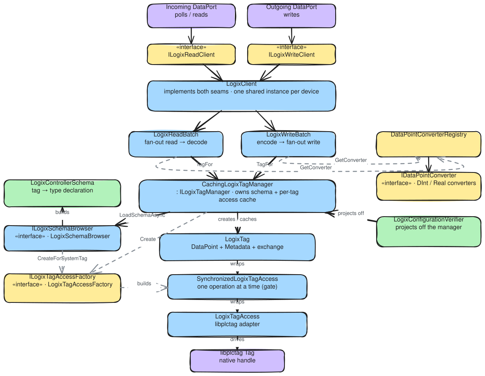

# Client architecture — how the classes collaborate

The Logix client is the layer between the two dataports and the native `libplctag` handle. It is one
stack, entered from two seams, that narrows a group of configured data points down to individual
reads and writes on the wire and back to typed values.

That one is the map, and it is deliberately flat: it names the collaborators and leaves the three axes
they collaborate along to a scene each.

| Scene | What it adds |
|---|---|
| [`client-connection-lifecycle`](../../diagrams/client-connection-lifecycle.excalidraw) | The pool, the factory and `ILogixClient`: who acquires a connection, who counts its holders, and where connect, disconnect and dispose land on the tag manager |
| [`type-gate-and-verification`](../../diagrams/type-gate-and-verification.excalidraw) | Where the controller's own `TagDefinition` comes from, and the one comparison the verifier makes against it at connect ([verifying configuration against the symbol table](../../ADR/2026-07-21-verifying-configuration-against-the-symbol-table.md)). The filename predates that comparison becoming connect-only — there is no longer a gate on the read or write path |
| [`read-write-paths`](../../diagrams/read-write-paths.excalidraw) | One poll and one write end to end, and why a single failed tag fails the batch it sits in |

All four are Excalidraw sources under [`diagrams/`](../../diagrams); re-export the SVG and run the
font-fix after editing one.

## The read/write path

- **`ILogixReadClient` / `ILogixWriteClient`** are the two seams the dataports depend on — the
  incoming port reads, the outgoing port writes — kept split so each direction depends only on what it
  uses ([maximizing throughput with one shared
  connection](../../ADR/2026-07-16-maximizing-throughput-with-one-shared-connection.md)). Each is the
  framework's own contract narrowed to our types —
  `IReadClient<LogixDataPointGroup, ILogixDataPointValue>` and `IWriteClient<ILogixDataPointValue>` —
  so a dataport base class can hold one without an adapter in between.
- **`LogixDataPointGroup`** is what a read takes: the points that share a poll frequency, which is the
  unit the incoming port schedules a job for. It is configuration, not I/O — the client turns one group
  into a batch of concurrent tag reads reported per point.
- **`LogixClient`** implements both, through `ILogixClient`, which adds the lifecycle. It is the *one
  shared instance per device*: giving both directions the same client is what makes them share the
  connection and the access cache underneath. It delegates each read and write to a batch.
- **`LogixReadBatch` / `LogixWriteBatch`** resolve every data point up front — a converter and an
  access apiece — then fan the individual operations out. A read decodes each buffer; a write fills the
  buffer its tag hands out first. No tag stops its siblings from being attempted in either direction, but
  what a failure costs differs. A read is batched purely for throughput, so a tag that would not read
  loses its own value, the rest are returned, and the client logs the ones that failed; only a read where
  nothing at all came back throws. A write still fails whole, throwing with every failed tag and its
  reason in the message.
- **`DataPointConverterRegistry` → `IDataPointConverter`** map each data-point type to its codec
  (`DIntConverter`, `RealConverter`, `LogixStringConverter`) and to what it expects the controller to
  declare. Decoding does not re-check that expectation: `LogixConfigurationVerifier` compared it against
  the controller at connect and aborted on a disagreement, so the batches read and write the type the
  configuration names ([verifying configuration against the symbol
  table](../../ADR/2026-07-21-verifying-configuration-against-the-symbol-table.md)).

## Values are typed by their data point

A data point is a `LogixDataPoint<TDomain>`, generic in the .NET type it exchanges, and it is the only
thing that makes a value of that type. A point hands one out through `CreateLogixValue` from a value
record nested in it — its own for a scalar, and the one `LogixArrayDataPoint<TElement>` carries for
every array shape — so a payload and the point it belongs to cannot disagree about their type. There is
no separate value class a caller could construct against the wrong point.

That leaves exactly one shape on the wire home: a typed value carrying a payload. There is no
valueless one, and no quality flag beside the payload, because a read that produced nothing fails its
group rather than returning something. Inventing a `default` and passing it off as the tag's contents
was never an option — zero and the empty string are things a tag genuinely holds — and a quality flag
that only ever reads `Good` is a flag nobody checks. The write path's converter still guards against a
value its data point did not make, because `ILogixDataPointValue` is public and an outside
implementation could be handed down.

Going the other way, `ILogixDataPoint.ConvertValue` is the single door an untyped `object?` enters
through. The outgoing port hands down whatever the engine gave it; the point either wraps it in its own
value record or returns a failure naming the tag and the type it wanted. Range is the second gate, and
`IsInValueRange` lives on the value record because that is where the configuration it is judged against
already sits. Only the configured shapes have anything to say: a `STRING` longer than the declared
capacity has nowhere to go, and an array of a length other than the declared count is a value of some
other tag. The elementary scalars are exactly their .NET types and answer `true`.

## The converter hierarchy

`DataPointConverter<TDataPoint, TDomain>` holds the one boundary cast from `ILogixDataPoint`, and it is
constrained to `LogixDataPoint<TDomain>` so the compiler checks that a converter and the .NET type it
decodes were paired correctly. Decoding stops at the `TDomain`; the data point wraps it. Below the base
the converters split by how the controller reports their type:

- **`AtomicDataPointConverter<,>`** covers the elementary types — the ones the controller names with
  a one-byte CIP code and that occupy a fixed number of bytes. It supplies the comparison they all
  share: a matching atomic code, neither an array nor a structure, and no capacity to agree on.
  `DIntConverter` and `RealConverter` name their code, and nothing else about matching is their
  business.
- **`LogixStringConverter`** derives from the base directly, because a Logix `STRING` is a structure
  on the wire and its comparison is the inverse: it *requires* a structure, and reports the new
  `Atomic` mismatch when the controller hands back an elementary type instead. Splitting the two lets
  each state what it expects rather than phrasing itself as an exception to the other.

Two consequences follow. No converter states how wide a tag is. `Encode` returns the bytes the value
occupies, sized from the type or from the point's configuration: four for a `DINT`, `.LEN` plus `.DATA`
for a `STRING`. The padding the controller adds after `.DATA` to reach its structure boundary is not the
converter's to know, and nothing in the client knows it either: the bytes go to libplctag's handle as
they are, and the handle, which is the controller's width, refuses a payload longer than itself before
anything is sent. That refusal comes home as a failed outcome naming the tag, like any device failure,
and a tag that has changed under a verified configuration is the only way to reach it. And the comparison
takes a `ResolvedDataPoint`, the configured point paired with the controller's declaration, because
checking a declared string capacity needs both halves and not the declaration alone.

## Connecting, and who owns the connection

Nothing about a Logix connection is a socket the client opens. libplctag opens one lazily, the first
time a handle is read, so a connect has no transport to establish — what it has to establish is the
symbol table, because that is what the configuration is verified against before any tag is polled. So
**`ILogixClient.ConnectAsync` is the browse**, and the browse coming back is also the proof that the
controller is reachable and answering CIP. A failure arrives as `ConnectionFailureException`, which is
the one exception the framework's acquire contract knows.

That makes the whole connection state the tag manager's: connect loads its schema, disconnect drains
it — freeing every handle and dropping the schema — and dispose ends it. Disconnect is reversible and
dispose is terminal, which is the framework's own split, and here it falls out of `CachingLogixTagManager`
having a `Drain` next to its `Dispose`.

- **`LogixClientPool`** (`IClientLifecycleManager<ILogixClient, LogixClientInformation>`) is what both
  dataports acquire from, and the reason they share one session rather than opening two. It keys on
  `LogixClientInformation` — gateway, path, controller family, per-operation timeout — reference-counts
  the client under it, and disconnects and disposes it when the last holder releases. Concurrent
  acquires for one controller wait on the first caller's connect through a per-entry gate, so nobody
  ever receives a client whose browse is still running. Splitting a controller's connection by poll
  class one day (the deferred Option 2 in the shared-connection ADR) is a change to the key, not to any
  of this.
- **`LogixClientFactory`** (`ILogixClientFactory`) is the one place the production stack is assembled:
  `LogixTagAccessFactory` → `TagDefinitionsLoader` → `CachingLogixTagManager` → `LogixClient`. The pool
  builds clients through it rather than with a `new`, which is what lets its tests drive reference
  counting and racing connects without a controller.
- **`LogixClientInformation`** carries the per-operation timeout alongside the address, because the
  timeout is sized for the worst case of draining *that* controller's shared queue. It is also the pool
  key, so it is what "the same connection" means.

## Access, cache, and the native handle

- **`CachingLogixTagManager`** (`ILogixTagManager`) owns the controller's `TagDefinitions` and hands
  out one `LogixTag` per data point, cached for its lifetime. It is the per-device tag cache and the
  owner of the definitions; draining or disposing it frees every handle.
- **`LogixTag`** joins the three immutable facts about a point — the configured
  `DataPoint`, the controller's `Metadata`, and the read/write access — into the single object every
  consumer projects off.
- **`SynchronizedLogixTagAccess` → `LogixTagAccess` → `libplctag Tag`** is the access chain. The
  synchronized wrapper gates one whole operation at a time on a shared handle ([Operations, not
  accessors](../../ADR/2026-07-16-operations-not-accessors-over-libplctag.md)); the inner adapter runs the
  read/write against the native `Tag` and maps its exceptions onto results.
- **`LogixTagAccessFactory`** (`ILogixTagAccessFactory`) builds those accesses — for data-point
  tags on behalf of the manager (`Create`), and for the `@tags` listing names on behalf of the
  definitions loader (`CreateForSchemaTag`).

## Tag definitions and verification

- **`TagDefinitionsLoader`** (`ITagDefinitionsLoader`) reads the controller's symbol table once at
  connect through the same exchange seam, decodes each entry with `TagsDecoder`, and **builds** a
  `TagDefinitions` — the tag-name → `TagDefinition` map, matched case-insensitively, that the manager
  joins onto every access.
- **`LogixConfigurationVerifier`** (`IDataPointConfigurationVerifier<ILogixDataPoint>`) reports the
  tags whose declared type, shape, or existence disagrees with the configuration. It holds an
  `ILogixClient` and gets its metadata from `ResolveDataPoints`, which is a *projection* of the tags the
  poll will use rather than a second browse — the definitions the poll reads from are the ones verified.
  The comparison itself is `LogixTypeComparison.Compare`, which this is the only caller of; the verifier
  renders the `LogixTypeMismatch` it reports as a message and nothing downstream asks again. It
  is the framework's own verification seam, so `IncomingDataPort.CreateConfigurationVerifier` returns one
  and a misconfigured tag aborts the connect.
- **`ILogixClient.ResolveDataPoints`** is that projection, and the client is where it lives for the same
  reason `IS7Client` has one: `CreateConfigurationVerifier` is handed a client, and the tag manager
  behind it is private. It calls `LoadTagDefinitionsAsync` (idempotent, so free after a connect) and
  pairs each data point with `ILogixTag.Resolved`, leaving a tag the controller does not have paired
  with `null`.
