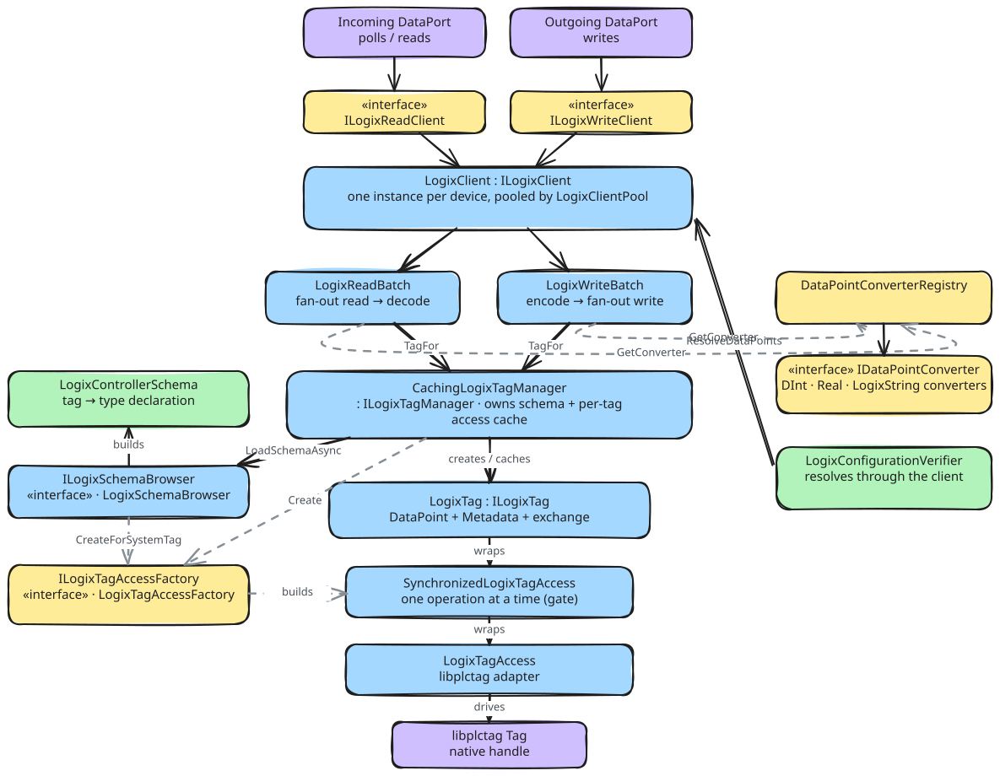

# About the client architecture

The Logix client connects the two dataports to the native `libplctag` handles. These pages explain why the client has
its current shape. They do not describe the code. The class names are in the diagrams and in the code, and the
decisions are in the [decision records](../../ADR/). These pages connect the three. They give the constraint behind a
choice, the alternatives, and the cost of the choice.

## Two constraints that we did not choose

The first constraint is the framework. `ViciOne.Suite.DataPort.Extensions` owns the lifecycle of a client. It gets a
client, connects it and verifies the configuration. Then it polls groups of data points or writes batches of values.
It also sets what a read can return and what a write can throw. These pages do not repeat the framework documentation
([documentation principles](../../../AllenBradley.Documentation/conventions/documentation-principles.md)).

The second constraint is `libplctag`. It has no connect call and no connection object, and it opens a dropped session
again by itself. It has one handle for each tag.
All handles to the same connection endpoint, route path and PLC type share one session. The first read of a handle
does an expensive setup, and each handle must be disposed explicitly. The
[library notes](../../../AllenBradley.Documentation/libplctag/README.md) give the source of each fact.

## The shape

A read and a write each become a batch. A batch starts one request for each tag and collects the results. Below the
batches is one tag manager for each controller. It owns the symbol table and one tag object for each data point. Each
tag object holds the access to one handle. The verifier uses the same tag objects as the polls, and has no second path
to the controller.

## The client during the life of a port

The framework uses the client in this sequence:

1. The port gets a client from the client pool. The pool keeps one client for each controller in the process, and
   counts the users of the client.
2. The framework connects the client. Connect loads the symbol table of the controller ([connecting](connecting.md)).
3. The framework runs the verification. The client creates the tag object for each data point, and the verifier
   compares its declared type with the configuration ([verification](verification.md)). No request goes to the
   controller in this step.
4. The polls and the write batches use the same tag objects. The first operation on each handle does the libplctag
   setup ([tags and handles](tags-and-handles.md)).
5. The port releases the client. The last release disconnects and disposes the client, and this frees all handles.

## The pages

Each page explains one part of the design. The source folders have the same division.

| Page                                                | What it explains                                                                                   | Folder                                         |
|-----------------------------------------------------|----------------------------------------------------------------------------------------------------|------------------------------------------------|
| [Reading and writing](reading-and-writing.md)       | How a poll and a write go through the client, and why a failed tag has a different result in each  | `Client/`                                      |
| [Values and their types](values-and-their-types.md) | Why only a data point can make its value, and why a converter knows nothing about the tag          | `Client/TypeConversion/`                       |
| [Connecting](connecting.md)                         | What connect does, which state it makes, and what the client pool shares between the two ports     | `Client/Pool/`                                 |
| [Tags and handles](tags-and-handles.md)             | Why there is one handle for each data point, who disposes it, and why one operation at a time is sufficient | `Client/Tags/Lifetime/`, `Client/Tags/Access/` |
| [The symbol table](symbol-table.md)                 | What the client reads at connect, why it reads all of it, and which question the table answers     | `Client/Tags/Symbols/`                         |
| [Verification](verification.md)                     | Why the port compares its configuration with the controller one time, at connect, in both ports    | `Verification/`                                |

The diagrams are in [`diagrams/`](diagrams/). Each diagram is an Excalidraw source and the SVG export of it. To edit a
diagram, obey the
[documentation principles](../../../AllenBradley.Documentation/conventions/documentation-principles.md#diagrams).
