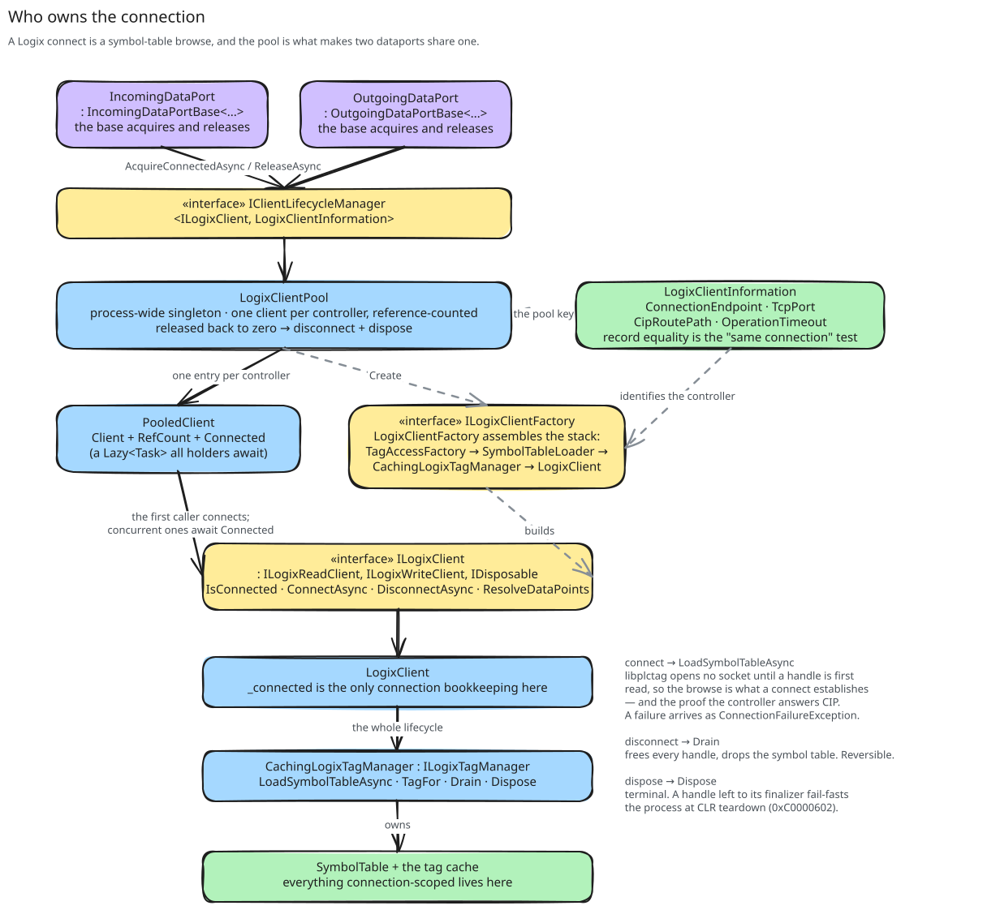

# About connecting

libplctag has no connect call. This page explains what the client does at connect, which state a connect makes, and
what the client pool shares between the two ports of one controller.

## libplctag has nothing to connect

A port does not connect its client. It gets a connected client from the client pool and gives it back after use. The
pool calls the connect, the disconnect and the dispose of the client. A later connect can undo a disconnect, and only a
dispose is final.

libplctag has no connect call and no connection object. The session to the controller opens by itself on the first
read of the first handle. All later handles to the same connection endpoint, route path and PLC type use the same
session ([the shared session](../../../AllenBradley.Documentation/libplctag/the-shared-session.md)). This is also true
for the handles of a different client. If the link drops, libplctag opens the session again by itself, and the handles
continue to work ([reconnecting the session](../../../AllenBradley.Documentation/libplctag/reconnecting-the-session.md)).

## Connect loads the symbol table

Connect does the one step that must occur before the client can create a tag object. It loads the
[symbol table](symbol-table.md) of the controller. The load has two more uses. The load is the first request, so a
successful load shows that the controller is reachable and speaks CIP. The verification also needs the table.

If the load fails, connect throws a `ConnectionFailureException`, and the port does not start. A cancellation stays a
cancellation, because the caller decided it.

`IsConnected` tells what the client did, not the state of the network. It is true from a successful load until the
disconnect. libplctag gives the state of its session in the `connection_status` tag attribute, but the client does not
read it.

## What the connection owns

The tag manager holds the state of the connection: the symbol table and the tag objects created until now. A
disconnect disposes all handles and drops the table. The next connect loads the table again, and the client creates
the tag objects again when it needs them. A dispose does the same and ends the tag manager.

Do not leave a handle to its finalizer. The finalizer frees the handle after the CLR shutdown started, and the process
then stops with `0xC0000602`
([tag disposal and shutdown](../../../AllenBradley.Documentation/libplctag/tag-disposal-and-shutdown.md)). Thus, a
disconnect disposes all handles also when one of them throws. The pool also disposes a client when its disconnect
throws.

## What the client pool shares

The client pool gives the incoming port and the outgoing port of one controller the same client. The session is not
the reason, because libplctag shares one session between the two ports also without the pool. The pool shares what
libplctag cannot share. The two ports use one symbol table, one cache of tag objects, and one connect and disconnect.
Without the pool, each port would load the full symbol table at each connect.

The pool keeps one client for each controller and counts its users. The last user that releases the client
disconnects and disposes it. These rules apply when users overlap:

1. The first user creates the client and starts the connect. A second user waits for the same connect. Thus, no user
   gets a client before its symbol table is loaded.
2. The connect uses the cancellation token of the first user. If the first user cancels, the connect stops for all
   users that wait for it. If a later user cancels, only its own wait stops.
3. The pool does not keep a failed connect. Each user that waits gets the failure and releases the client. After the
   last release, the next user creates a new client and tries again.
4. A dispose of the pool does not wait for a connect in progress. A controller that does not answer is a possible
   reason for the dispose. The user of that connect gets an `ObjectDisposedException`.

## What counts as one controller

The pool key is the controller identity: connection endpoint, TCP port, route path and operation timeout. The key does
not contain the controller family. Thus, two ports on one controller share a client, also if their family settings are
different. The model keeps the endpoint and the TCP port apart. The client joins them only for the gateway attribute of
libplctag ([the port in the gateway attribute](../../../AllenBradley.Documentation/libplctag/the-port-in-the-gateway-attribute.md)).

The key contains the operation timeout. Thus, two ports on one controller with different timeouts get two clients.
Each client loads its own symbol table and has its own handles. The two clients still use one libplctag session,
because the timeout is not part of the session key of libplctag.

The pool key is also the place for a later session for each poll frequency
([maximizing throughput with one shared connection](../../ADR/2026-07-16-maximizing-throughput-with-one-shared-connection.md)).

## What this means at run time

If the link to the controller drops, libplctag finds this at the next request that fails. It then tries to open the
session again, with a delay that increases to 10 s and no retry limit
([reconnecting the session](../../../AllenBradley.Documentation/libplctag/reconnecting-the-session.md)). The handles
continue to work, so the client has no reconnect code. The framework has no reconnect of its own either. It keeps the
same client and uses its retry and its circuit breaker.

During the outage, reads and writes fail, and libplctag does not queue them for later. A poll in which no tag answers
throws, and after enough failures the circuit breaker of the framework opens. A write batch that failed stays at the
head of the write queue, and the framework writes it again. After libplctag opened the session again, the next poll
and the next write succeed.

libplctag closes a session without traffic after an inactivity timeout, and opens it again for the next request. Thus,
a port without traffic does not find a pulled cable until its next read or write.

The symbol table loads again only when the pool creates a new client. This occurs only after all ports of the
controller released the client. A port that reconnects alone gets the same client with the old table. Thus, a tag that
somebody added to the controller becomes available only after all ports of the controller connect again.
