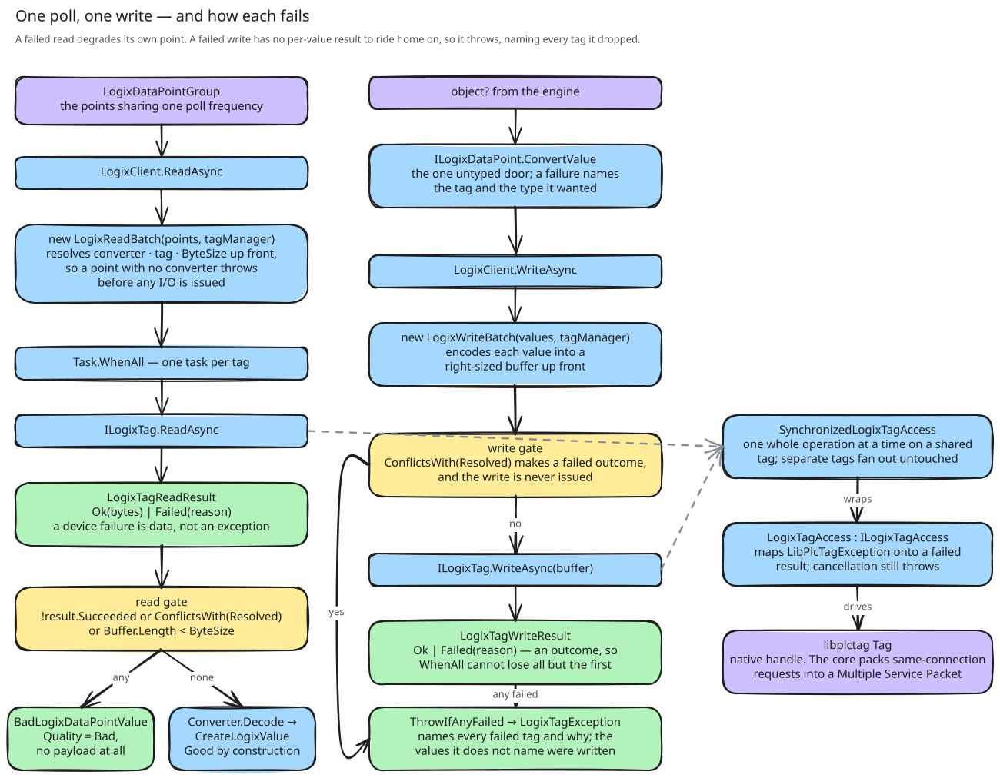

# About reading and writing

This page follows one poll and one write through the client. It also explains why a failed tag has a different result
in the two directions.

## What the framework asks for

The incoming port groups its data points by poll frequency and schedules one polling job for each group. Each job
gives its group to the client and expects one typed value for each data point. The outgoing port queues engine
values, converts each one into a typed value, and gives a batch to the client. A write returns nothing: it completes
or it throws. The polling jobs, the write queue, the retries and the circuit breaker belong to the framework, and its
documentation describes them.

libplctag sets the other limit. All handles to one controller share one session, and the session packs the requests
that wait at the same time into one packet. There is no timer to adjust. Requests go into one packet only when they
arrive while the session thread waits for the previous packet
([the shared session](../../../AllenBradley.Documentation/libplctag/the-shared-session.md)). Thus, the throughput of a
poll depends on the number of requests in flight at the same time.

## The two phases of a batch

Each read and each write becomes a batch, and a batch has two phases
([reading and writing a group of tags](../../ADR/2026-07-16-reading-and-writing-a-group-of-tags.md)):

1. The batch gets all that it needs before any I/O: the converter and the tag object for each data point. A write
   batch also encodes each value.
2. The batch starts one request for each tag, waits for all of them, and sorts the results.

The requests start at the same time because of the packing. A loop that reads one tag after the other never gives the
session two requests to pack. A poll of 100 tags would then need 100 round trips.

The first phase finds configuration mistakes before the controller gets a request. A data point without a converter
fails the batch in this phase. In a write batch, a value that does not encode also fails the batch, and nothing is
sent. The error names each value that failed.

A device failure is a result, not an exception. `Task.WhenAll` rethrows only the first exception of a set, and the
results of all other tags would be lost. A reply that does not decode is also a failure of that tag only. A
cancellation still throws, because the caller decided it.

## A read continues, and a write fails as a whole

A poll is a sample, and the next poll is already scheduled. Thus, a tag that fails loses only its own value. The client
returns the values of the other tags in the sequence of the group, and it logs all failures as one warning. The engine
keeps the last value of a data point that is missing from the list.

A read throws only when no tag gave a value and the group is not empty. The circuit breaker of the framework needs
this. An empty list would make a dead controller look like an empty group, and the breaker would never open.

A write sets state. When the controller is down, the outgoing port keeps the batch at the head of its queue and writes
it again until the write succeeds. The client makes this retry safe in two ways. First, it encodes each value before it
sends anything. Second, after the send, one exception names each tag that failed. The tags that the exception does not
name were written.

The retry writes the full batch again, also the values that were written before. This is safe for a tag that only the
engine writes. It is not safe for a tag that the controller program also changes, for example a flag that the program
resets.

We looked at three other options:

- Throw at the first failure. A plain `await` does this, but it hides all later failures.
- Give a placeholder value with a bad quality flag for a failed read. The list would then be complete, but it would
  contain a value that the tag never held ([values and their types](values-and-their-types.md)).
- Give one result for each written value. A write could then continue like a read. But the write method of the
  framework has no place for these results.

## What this means for a user of the values

Do not expect one value for each data point. The list from a read can be shorter than the group. It contains one value
for each tag that answered, in the sequence of the group. A missing data point is a failed read, and the log has a
warning for it. A write completes without a result, or it throws an exception that names each failed tag.

A type mismatch between the data point and the controller does not cause these failures. The verification at connect
prevents it, unless the controller changed after the connect ([verification](verification.md#after-connect)).

The gate that lets one operation at a time run on a handle limits each handle, not the batch
([tags and handles](tags-and-handles.md)). A batch of 100 different tags still starts 100 requests. Two batches that
use the same tag wait for each other at its handle. The client has no limit on the requests in flight yet. The
throughput measurement must supply this limit
([maximizing throughput with one shared connection](../../ADR/2026-07-16-maximizing-throughput-with-one-shared-connection.md)).
