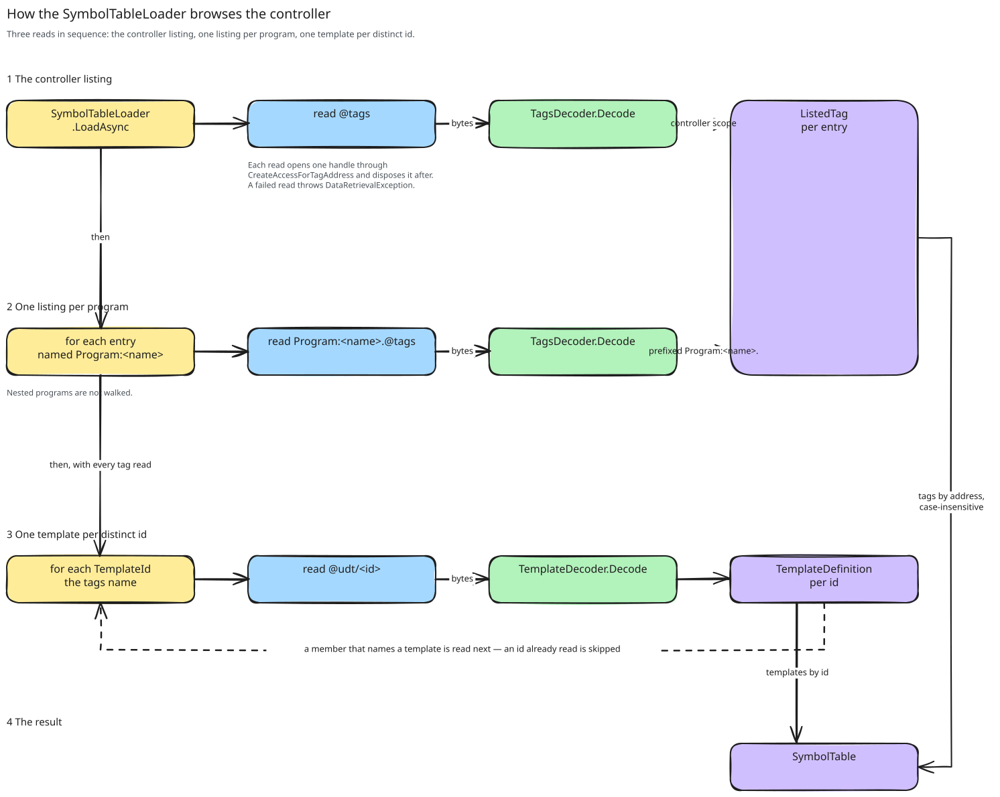

# About the symbol table

This page explains what the client reads from the controller at connect, why it reads all of it, and which question
the result answers.

## What the controller tells about its tags

A Logix controller gives its tags as Symbol objects, and the layouts of its structures as Template objects. libplctag
reads both through pseudo-addresses:

- `@tags` lists the tags in controller scope. Each entry has a name and a symbol type. The symbol type holds the
  structure bit, the array rank, and a type code or a template id
  ([symbolic tag data types](../../../AllenBradley.Documentation/protocol/allen-bradley-extension/symbolic-tag-data-types.md)).
- `Program:<name>.@tags` lists the tags of one program.
- `@udt/<id>` gives one template, with its members, their offsets and their types
  ([reading a UDT definition](../../../AllenBradley.Documentation/libplctag/reading-a-udt-definition.md)).

Two gaps in the listings control the design. First, a listing contains no member and no element. `Motor.Speed` and
`Readings[3]` are in no listing, only `Motor` and `Readings` are. Second, a listing identifies a structure only by its
template id. Thus, a structured tag has no data type in the listing. Its members, and whether it is a string, are in
its template.

## Three reads, all at connect

The load reads in this sequence:

1. It reads the controller listing.
2. It reads one listing for each program that the controller listing names.
3. It reads one template for each template id that the listed tags use. Then it reads the templates that the members
   use. It does not read a template two times.

Each read opens its own handle and disposes it immediately after the read, because the handle has no use after the
load. If the controller refuses a read, or a template does not decode, the load fails. A failed load is a failed
connect ([connecting](connecting.md)).

The load reads the templates at connect, and not when a path first needs them. This costs one read for each template
at each connect. We pay this cost because the lookup must be in memory. It runs when the tag manager creates a tag
object, inside a lock that does not permit I/O. Also, with later reads, a connect could succeed although some
templates cannot be read. The first sign of the problem would then be a failed poll.

The load does not read programs inside programs, so a tag like `Program:Parent.Child.Tag` is not found
([tag scoping](../../../AllenBradley.Documentation/protocol/allen-bradley-extension/tag-scoping.md)). The local tags of
an Add-On Instruction are not in a listing, because nothing outside the instruction can read them.

## One question, answered by a walk

The symbol table holds the listed tags by address and the templates by id. It compares names without case, because
the controller does the same. A configuration that writes a tag name in a different case is correct.

The table answers one question: what does the controller declare for the value at a given path? The answer is a
declared type. [Verification](verification.md) compares it with the data point. To find the answer, the table walks
the path:

1. It finds the listed tag from the program and the tag name. A listing names nothing more than these two.
2. For each member in the path, it finds the member in the template of the type reached until then.
3. If the path ends with a subscript, it steps into the array. The result is a scalar of the element type.
4. If the result is a structure whose template has a `.DATA` member of `SINT` elements, the result is a string. Its
   capacity is the element count of `.DATA`.
5. If the result is a structure whose template is named `TIMER`, the result is a timer.

Step 4 is how the port identifies a string. Thus, a string type of the project with a different capacity is a string
to the port, like `STRING`. Step 5 can go by the name, because Studio 5000 reserves `TIMER`, so no UDT can have it.

If a step fails, the table gives no answer. This occurs when the tag is not listed, or when a member is not in its
template. It also occurs when the path asks for a member of an array or of an atomic type. An element of a scalar, or
past the end of an array, also gives no answer. The verifier reports each of these as a tag that the controller does
not have. The report does not tell which step failed, because the address in the report shows the incorrect part.

A path has a maximum of one subscript, and only at its end. `Motors[2].Speed` is not a path of this port
([data type support](../../reference/datatype-support.md)).

## Where the walk stops today

A system structure has bit `0x1000` set in its symbol type. The controller gives no template for it, so the load does
not ask for one. A path into the members of a system structure is not found.

The predefined structures `TIMER` and `COUNTER` have templates, and the walk follows them like a UDT. `Timer1.PRE`
resolves to a `DINT`, and `Timer1` itself to a `TIMER`. It is not decided if the port supports `COUNTER` and Add-On
Instruction instances the same way as a UDT ([data type support](../../reference/datatype-support.md)). A structure
that is neither a string nor a timer is never a value in this port. The port only opens it into members.

The nodes of the walk are internal to the symbols folder. Thus, the format of a listing can change, and the rest of
the client does not see the change.
