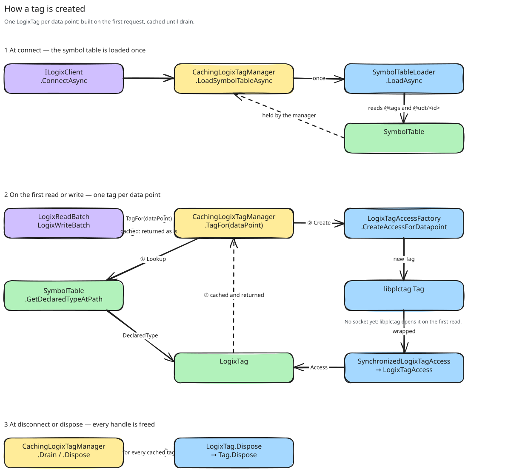

# About tags and handles

libplctag gives the client one handle for each tag. This page explains why the client keeps one handle for each data
point, why only the tag manager disposes a handle, and why one operation at a time on a handle is sufficient.

Three words have different meanings on this page. A *tag* is the tag on the controller. A *handle* is the libplctag
`Tag` object ([CONTEXT.md, "Tag handle"](../../../../CONTEXT.md)). A *tag object* is the client object that joins a
data point to its handle.

## The handle is the expensive part

The first read of a handle does the session registration, the Forward Open and the resolution of the tag name. Later
operations on the same handle skip this setup. If the client discards a handle, it discards the setup too
([the shared session](../../../AllenBradley.Documentation/libplctag/the-shared-session.md)).

Two more facts about the handle control the design:

- The buffer of the handle holds the value in the memory layout of the controller. Its width is the width that the
  controller declares, not the width of the client value
  ([what the tag buffer holds](../../../AllenBradley.Documentation/libplctag/what-the-tag-buffer-holds.md)).
- Two operations that overlap on one handle fail. libplctag refuses the second one with a busy status, and the wrapper
  then gives the completions to the wrong callers
  ([concurrent operations on a handle](../../../AllenBradley.Documentation/libplctag/concurrent-operations-on-a-handle.md)).

## One tag object for each data point

The tag manager creates the tag object for a data point at the first request for it. Usually, the verification step
after connect makes this request. The creation sends nothing to the controller, because libplctag does its setup on
the first read or write. The tag manager keeps the tag object until the disconnect
([reusing and releasing tag handles](../../ADR/2026-07-16-reusing-and-releasing-tag-handles.md)).

The cache key is the full data point record, with its poll frequency and its channels. Thus, one tag at two poll
frequencies gives two data points and two handles. The tag address as the key would save one handle. But then the two
polling jobs would wait for each other at the gate of the shared handle. The second handle costs one setup and nothing
after that.

A tag object holds three values that do not change: the data point, its declared type and the access to the handle. The batches read and write through it. The [verification](verification.md) reads the
data point and the declared type from it. Thus, the verification checks the declared type of the same handle that the
polls use, and no second lookup can give a different answer.

## Only the tag manager disposes a handle

A user of a tag object borrows it. Only the tag manager disposes it. If a user disposes a tag object, all other users
of it fail.

Each handle must be disposed explicitly. A handle that a finalizer frees stops the process at CLR shutdown
([tag disposal and shutdown](../../../AllenBradley.Documentation/libplctag/tag-disposal-and-shutdown.md)). Thus, the tag
manager continues to dispose the other handles when one of them throws, and it logs the error.

One lock protects the creation and the disposal of tag objects. Thus, the client cannot create a handle after a
disconnect emptied the cache. The lookup of the declared type also runs inside this lock, so it cannot read from the
controller. For this reason, connect loads the full [symbol table](symbol-table.md) before any lookup.

## One operation at a time on a handle

The access to a handle has two layers. Each layer answers one of the libplctag facts above.

The outer layer lets only one operation at a time run on a handle. Each operation is complete: a read returns the
bytes, and a write takes the bytes. The client never gives access to the buffer of the handle between two libplctag
calls. If two users mixed these calls on one handle, each could get the bytes of the other
([operations, not accessors](../../ADR/2026-07-16-operations-not-accessors-over-libplctag.md)). The gate is on each
handle, so different handles do not wait for each other ([reading and writing](reading-and-writing.md)).

The inner layer is the adapter to libplctag. It changes a libplctag exception into a failed result, and only a
cancellation still throws. Thus, a device failure becomes data, and a batch can report each failed tag, not only the
first one.

The unit tests replace the access with a fake. Thus, they test the cache rules and the batches without a native
handle.

## What the factory sets on a handle

The access factory gives each handle the same connection attributes: the connection endpoint with its TCP port, the
route path, the PLC type, the timeout and request packing. libplctag has one PLC type for all Logix controllers, so a
CompactLogix opens as a ControlLogix.

Only the tag address and the element count change from one data point to the next. libplctag sends the element count
in the request without a change. Thus, the element count is the count of the controller, not the count of the value:

- A scalar has the count 1.
- An array has its configured element count.
- A `BOOL` array has the count of its 32-bit words, because the controller packs the bits into words.

The factory does not set the element size. For Allen-Bradley, libplctag ignores it and gets the width from the
controller.

The client does not use the typed mapper API of the wrapper. Upstream will remove it. Also, a failed write can leave a
partly encoded buffer in it
([writing into the tag buffer](../../../AllenBradley.Documentation/libplctag/writing-into-the-tag-buffer.md)).

## What this means at run time

- The first poll after a connect is slower than the second, because it does the setup of each handle. Each new
  client pays this cost again, because the disconnect of the old client freed all handles.
- A dispose does not wait for the gate, because a wait there could block forever if an operation never completes.
  Thus, a disconnect during an operation can free a handle that is in use. The
  [ADR](../../ADR/2026-07-16-reusing-and-releasing-tag-handles.md) records this as an open item.
- Two batches that use the same data point wait for each other at the gate of its handle.
- The client does not compare the declared type again after connect. The [verification](verification.md#after-connect)
  page tells which changes the client finds at run time.
