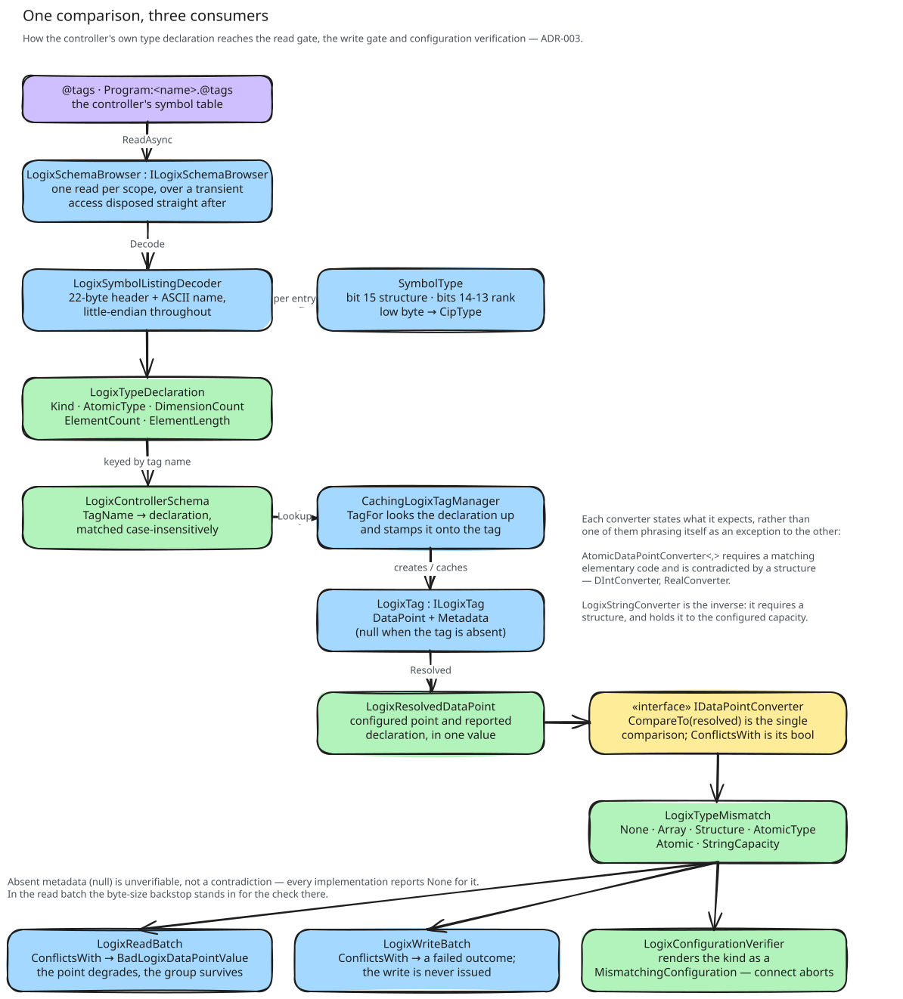

# About verification

The configuration is compared against the controller once, at connect. This page says what is compared, in which order,
and why the write port runs the comparison as well.

## Catch it once

The framework runs a verification step right after connect and before the first poll, and a data point it reports as
misconfigured aborts the connect. The step is the framework's. What it compares against is the port's. The sibling S7
dataport fills it by diffing each data point against its controller's symbol table, and this port does the same over CIP
([verifying configuration against the symbol table](../../ADR/2026-07-21-verifying-configuration-against-the-symbol-table.md)).

The alternative is to let a misconfigured tag surface as a bad read. It would surface, because the converter would be
handed a buffer of the wrong length. But it would surface on every poll, as one more warning in a log that already has
a few, and a `DINT` configured as an `INT` would decode into garbage that looks like data. A configuration that
disagrees with the controller is an engineering mistake. The place to catch one is at connect, once, with a message
that names the tag and both sides of the disagreement.

## One comparison, one place

Exactly one function compares the declared type against the configuration, and the verifier is its only caller. An
earlier design compared on the read path and the write path too, with each converter stating the type it required. That
was three consumers of one rule, and it paid on every operation for something that happens once, at a download. The
comparison moved to connect, the converters stopped stating anything, and what is left on the read path is cheap: a
buffer whose length does not fit is that tag's failure ([values and their types](values-and-their-types.md)).

The verifier does not read the controller itself. It takes the controller's side from the very tags the polls will run
against, each of which carries the declared type that was stamped onto it when its handle was created
([tags and handles](tags-and-handles.md)). The declaration that gets verified is therefore the one the polls read
under, and no second lookup can disagree with the first.

## What is compared, and in which order

Rank comes first. A scalar configured against an array, or the other way round, makes every later comparison
meaningless, so the report names the shape and stops there. Then the data type. Then whatever the configured shape
adds, a string's capacity or an array's element count. That is why the comparison takes the configured point and the
declaration together rather than the declaration alone. An elementary scalar adds nothing.

An absent declaration is not a contradiction. The [symbol table](symbol-table.md) answers nothing for a path it cannot
walk, and the verifier reports that path as a tag the controller does not have before the comparison is ever asked. The
comparison itself reports no mismatch for it, so an absent tag is one finding and not two.

## Why the write port verifies too

The verification step exists for polling, and a write-only port could skip it. This one does not, because of what a
write failure costs. The outgoing port waits for a controller that is down instead of writing it off, so a value whose
type contradicts the controller would be a write that retries forever, and the log would say only that the controller
refused it. Verified at connect, it is one message naming the tag and the two types, and the port does not come up.

## What this means for the operator

One wrong tag takes the whole port down at connect. We meant it to. The message says which tag it is, and whether the
shape, the type, the string capacity, the element count or the tag's existence is what disagrees. The fix is in the
configuration or in the project, never in the port.

Verification does not run again while the port runs. A download that changes a verified tag's type under a running port
shows up as that tag failing on every operation, because its handle refuses a payload of the wrong width or its reply
no longer decodes. It is verified again at the next connect.
