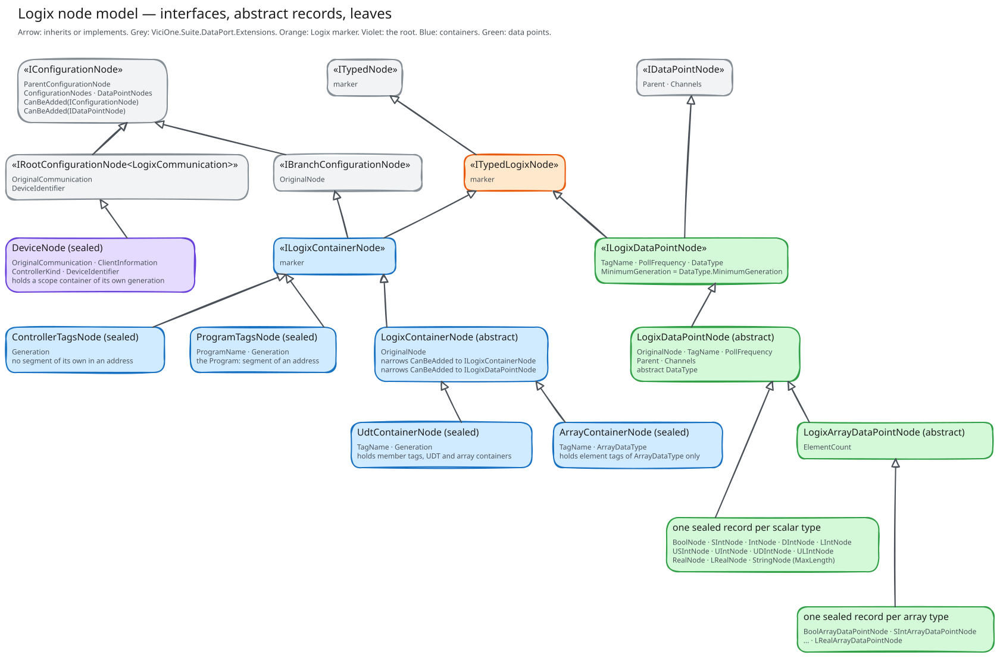

# The node model

A configured Logix port is a tree. The editor builds it from the manifest `allen-bradley-logix.yaml` and hands it over
as untyped `LinkedNode` objects. The node model is what the dataport turns those into, one record per node type the
manifest declares and one mapper per record. This page says why the model is shaped the way it is. What each member
does is in the source and in IntelliSense.

The tree only exists at configuration time. It lives between mapping and the first read, and then it is gone.
`LogixDataPointsGroupsMapper` walks it once and produces the data points both ports work from. A node is therefore not
a runtime object. It is a decision somebody took in the editor, made typed so that the dataport can refuse it before a
controller is ever contacted.

## The shape

Read the diagram in three bands.

1. **Grey** is `ViciOne.Suite.DataPort.Extensions`. It owns the tree, the traversal and the mapping. None of it is
   explained here ([documentation principles](../../../AllenBradley.Documentation/conventions/documentation-principles.md)).
2. **Orange** is one empty interface, `ITypedLogixNode`. It marks a node as this dataport's.
3. **Violet, blue and green** are the dataport's own types: the root, the containers and the data points.

## Three kinds of node

The framework knows three roles, and the dataport has one branch of the tree for each.

**`DeviceNode` is the root.** It carries the controller to reach, plus the family and generation it was configured
under. It is the only node without a parent, and the only one that holds a `LogixCommunication`.

**A container is a branch.** It holds other containers and data points, and it is where the tree gets its depth. There
are four: the two tag scopes, the UDT container and the array container.

**A data point node is a leaf.** It is one configured tag, or one member, or one element. It carries a `TagName`, a
`PollFrequency` and an `AllenBradleyDataType`, and nothing else the port reads.

## Why the marker interfaces

`ITypedLogixNode`, `ILogixContainerNode` and `ILogixDataPointNode` carry almost nothing, and two of the three declare no
member at all. They are there because the framework's `CanBeAdded` takes an `IConfigurationNode` or an
`IDataPointNode`, which is any node of any dataport. A gate that has to compare generations cannot work with that. So
`LogixContainerNode` narrows both methods once. It rejects anything that is not a Logix node and delegates to an
abstract overload that takes the narrow type. Each container then writes its rule against `ILogixContainerNode` and
`ILogixDataPointNode` only, and no concrete container repeats the type test.

`ILogixDataPointNode` is the one marker with members on it, because every gate asks about two of them: `DataType`, and
the `MinimumGeneration` derived from it.

## The gates are the model's only behaviour

A node record holds data. The one thing it computes is whether a child may sit under it.
It reflects the possible parent-child-relationships in the yaml, but might not map 1-to-1 to avoid code-duplication.

| Container                               | Accepts as a child                                                                                                                           |
|-----------------------------------------|----------------------------------------------------------------------------------------------------------------------------------------------|
| `DeviceNode`                            | A `ControllerTagsNode` or a `ProgramTagsNode` of the device's own generation. No tag directly.                                               |
| `ControllerTagsNode`, `ProgramTagsNode` | A UDT container of the same generation, an array container whose element type that generation has, and a tag whose type that generation has. |
| `UdtContainerNode`                      | The same three, with a nested UDT held to the same generation.                                                                               |
| `ArrayContainerNode`                    | An element tag of exactly the container's `ArrayDataType`. No container.                                                                     |

Two rules run through all four.

**Generation is carried down, not looked up.** A 5X80 controller has `USINT`, `UINT`, `UDINT`, `ULINT` and `LREAL`. A
5X70 controller does not. A container could ask its parent chain for the device it hangs under, but it does not. Each
one is mapped from a node type that names the generation, so `Udt5X70` and `Udt5X80` are two manifest nodes over one
record, and each holds that generation as a field. A gate is then a local comparison, and a node is testable without a
tree around it. The price is a manifest that declares each container twice.

**A type is compared, never parsed.** The array container holds an `AllenBradleyDataType` and takes an element only
when the element's type equals it. There is no assignability rule and no widening. A `DInt` element under an
`SIntArrayContainer` is a configuration error rather than a conversion.

## Why records, and why one per type

Every node is a `record`, and every value on it is a named value type: `TagName`, `PollFrequency`, `ProgramName`,
`ElementCount`, never a bare `string` or `int`. That is the repo's
[modelling convention](../../../AllenBradley.Documentation/conventions/modelling-conventions.md), and the node model is where it
pays off. A mapper that reads two string properties off a `LinkedNode` cannot swap them.

There is one sealed record per data type rather than one record with a type field. `DIntNode` and `RealNode` differ
only in their `DataType` and their `LinkedNodeTypeId`, which looks like duplication until you count the other two ends.
The manifest declares one node type per Logix data type, a mapper is resolved by `LinkedNodeTypeId` alone, and
`LogixDataPointsGroupsMapper` switches on the node to build the matching data point. One record per type keeps those
three in step, and the compiler reports a type whose slice is half finished.

The abstract records are there where the repetition is real rather than apparent. `LogixDataPointNode` holds what every
tag has. `LogixArrayDataPointNode` adds the one thing an array adds, its `ElementCount`. The mappers mirror that split
exactly: `LogixTagNodeMapper` reads the tag name and the poll frequency, and `LogixArrayNodeMapper` adds the element
count.

## The repetition worth knowing about

All four containers extend `LogixContainerNode`, so each writes its rule against the narrow types only and none repeats
the parent reference, the child lists or the type test. A new container belongs there too.

What is still written out more than once is the generation gate itself. Both scope containers and the UDT container
say the same three things: an array container whose element type the generation has, a UDT container of the same
generation, and a tag whose type the generation has. The three stay separate records because each is mapped from its
own node type and contributes its own segment to an address: none, a program, or a tag name. Folding the gate into a
record between them is an open item.

## Scope is a container, not a property

A Logix tag lives in controller scope or in one program's scope, and only program scope adds a segment to the address.
That is controller behaviour, and it is described in
[tag scoping](../../../AllenBradley.Documentation/protocol/allen-bradley-extension/tag-scoping.md). What matters here
is what the model does with it. Scope is configuration, and structure nesting is discovery. The two look alike in an
editor tree and behave nothing alike, and keeping them apart is most of what the container types are for.

Each scope is a container hanging off the device, and the two are peers, the way Studio 5000's own tree puts them,
rather than a program folder nested inside controller scope. `ControllerTagsNode` carries no property that reaches an
address, because controller scope contributes no segment. A tag configured under it addresses itself. `ProgramTagsNode`
is the one that prefixes, and its `ProgramName` is what it prefixes with. A UDT container is the other kind of prefix.
It carries a tag name, a member node under it carries the member's name, and so `MyMotor.Speed` is two nodes.

`ProgramName` is therefore validated as a well-formed name during mapping, before any controller is reached. A
program's tag listing cannot be read until its name is known, so loading the symbol table depends on it. Verification
against the symbol table confirms the tags inside a program. It cannot be the thing that discovers the program.

## What a node does not carry

A node has no address. `TagName` on a UDT container is the tag. The same property on a nested container is a member
name, and on a node under an array container it is a subscript. Which of the three a name turns out to be is decided
while the tree is walked, never stored on the leaf.

`LogixDataPointsGroupsMapper` walks every container under the device and appends the segment each one contributes to a
`ContainerPath`, a program, a tag name or a subscript. At each leaf it reads the segments back into a `TagPath`: the
program from the scope and none for controller scope, the first named container or node as the tag, every name behind
it as a member, and the subscript last. The data point carries that path and renders `Program:MainProgram.Count` from
it when `libplctag` asks. So a tag is configured as `Count` wherever it sits, and an address exists only from the data
point outwards. An element under an array container is the same walk with the last slot filled, which is how
`Program:MainProgram.Readings[3]` comes out of three nodes. A shape that no address reaches, a member behind a
subscript such as `Motors[2].Speed`, is refused when the path is read back rather than by a node.

A node carries no template either. What the members of a UDT are, and whether the configured member exists at all,
comes from the controller's own template at connect. The node model states what was configured.
[Verification](../client/verification.md) states whether the controller agrees.

## Adding a node type

A new data type is four edits, and they have to agree:

1. The node type in `allen-bradley-logix.yaml`, and its place in every parent's child list. A scalar goes in the
   `Scalar` namespace and a whole array in `Array`, which is how the editor groups the data point nodes.
2. The record under `Model/Nodes/`, with its `LinkedNodeTypeId` and its `DataType`.
3. The mapper beside it, and its entry in `TypedLogixNodeMapper`.
4. The `LogixDataPointsGroupsMapper` switch, and the data point it produces.

Which types exist today, and which are still missing, is in the
[data type support reference](../../reference/datatype-support.md).
